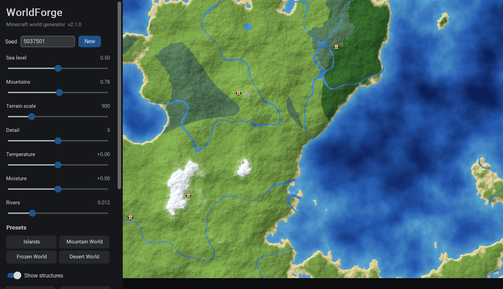

# WorldForge

WorldForge is a Windows app that draws a Minecraft style world on a live top down map. You shape the world with sliders, watch it change in real time, then export it as a real Minecraft Java world and play it.



## What it does

The app generates a world from a seed, just like Minecraft does. The map shows oceans, rivers, beaches, forests, jungles, deserts, mountains and snow. You can drag the map to explore, zoom from a whole continent down to single blocks, and tune the world until it looks right. When you are happy, one button turns the map into a playable Minecraft world.

## Features

* Live map with smooth water depth, shaded terrain and textured forests
* Sliders for sea level, mountains, terrain scale, detail, temperature, moisture and rivers
* Preset worlds: Islands, Mountain World, Frozen World and Desert World
* Villages, temples, monuments and mansions marked on the map
* Export the current view as a PNG image
* Export a playable Minecraft Java world with terrain, water, biomes, trees and a safe spawn point
* Fast: the renderer uses every CPU core and caches noise, so sliders feel instant

## Download

Get `WorldForge.exe` from the Releases page. No install is needed. The first start takes a few seconds because the app unpacks itself. Windows SmartScreen may warn you once because the file is not signed. Click More info, then Run anyway.

## Exporting a Minecraft world

Press the blue Export Minecraft world button. Pick a name, a size and a destination folder, then export. If Minecraft is installed in the usual place, the app suggests your `.minecraft\saves` folder on its own. You can pick any other folder with the Change button. If you export somewhere else, move the world folder into `.minecraft\saves` afterwards so it shows up in Singleplayer.

The world is written in the Java Edition 1.18.2 format on purpose. Minecraft opens worlds from older versions and upgrades them by itself, so this one format works in 1.18.2 and everything newer, including 1.20, 1.21 and the latest versions. Versions older than 1.18.2 can not open it.

Good to know: the exported terrain has no caves or ores. Underground is plain stone, it is purely for exprementation, future updates might such features.

## Run from source

You need Python 3.10 or newer.

```
pip install -r requirements.txt
python world_forge.py
```

## Build the exe yourself

```
pip install pyinstaller
pyinstaller --noconfirm --onefile --windowed --name WorldForge --collect-all customtkinter world_forge.py
```

The exe appears in the `dist` folder.

## Controls

Drag the map to pan. Scroll to zoom. The bar at the bottom shows the position, the height and the biome under your mouse. Type a seed and press Enter, or press New for a random one.

## License

MIT. See the LICENSE file.
